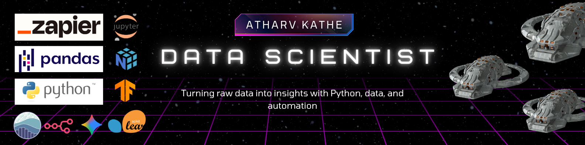

---

## <h1> Hello I’m Atharv Kathe  </h1>
<p align='center'>

## 🧠 Terminal Log – About Me 

```bash
> atharvkathe --whoami
💻 Self-taught Data Scientist with a background outside tech
🧩 Background in non-tech, learning by building real projects
⚙️ Skilled in Python, ML frameworks, OpenAI, Notion, Zapier
🔁 Designs AI workflows that connect data with actions
🌍 Navi Mumbai, India
> _ 
```
💬 Quote: *“Designing practical AI workflows with Python, data, and automation.”*

📫 Reach me → [katheatharva2000@gmail.com](mailto:katheatharva2000@gmail.com)  
🔗 Connect on [](https://www.linkedin.com/in/atharvkathe/)

---

## 🧰 My Tech Stack 

### 🐍 Programming Language


### 🧠 AI / ML Libraries
  
  
  
  
  
  
  
  

### ⚙️ Tools & Automation
  
  
  
  
  
  

### 🖥️ Dashboards & Interfaces
  
  


## 📊 GitHub Stats

<p align="center">
  
  
</p>

---

